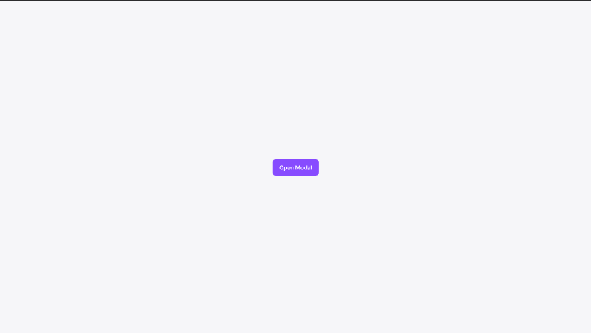
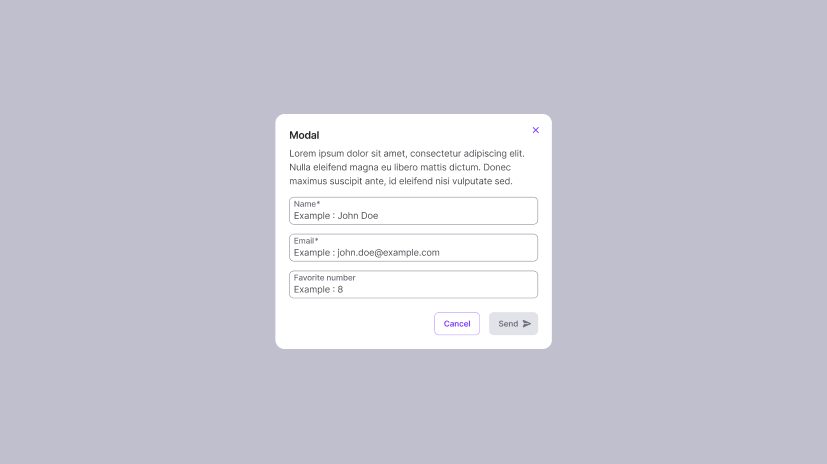

# Design System avec Web-components
Dans ce projet, je créer une ébauche d'un design system avec web-components. C'est un premier essai et il pourra être amélioré avec d'avantage d'expérience sur cette technologie.

## Challenge 🔨
Il faut créer un petit design system en utilisant uniquement web-components. **Les frameworks JS comme React, Vue ou Angular ne sont pas autorisés.**

On peut utiliser des librairies ou des outils compatibles avec la technologie web-components, si l'on est en mesure d'expliquer ses choix par rapport aux objectifs fixés.

Les points clés : 
- Se rapprocher le plus possible du design
- Avoir une bonne qualité de code
- Travailler sur l'accessibilité des composants

## Screenshots 📸



## Technologies utilisées 💡

- **Lit** : C'est la librairie la plus utilisée pour créer des web-components. Elle est même recommandée dans [la documentation officielle de web-components](https://www.webcomponents.org/introduction). Il y a beaucoup d'intérêts à l'utiliser pour ne citer que quelques avantages : un code moins verbeux, c'est à dire moins de ligne de code, moins de répétitions, plus clair, plus simple à écrire et à maintenir. Le rendu est efficace et ultra rapide, ce qui est très pertinent lorque l'on développe un design system ( car beaucoup d'itérations ). Une meilleure réactivité, les composants se mettent à jour rapidement aux changements des props...

- **TypeScript** : apporte un niveau de sécurité, de cohérence, de documentation et de maintenabilité supplémentaires qui sont particulièrement importants pour le développement d'un design system. Cela permet de créer un design system robuste, facile à utiliser et à adopter par d'autres équipes de développement.

- **ViteJS** : outil de build, je l'ai utilisé ici pour créer rapidement un environnement lit/typescript performant et pour un déploiement simple sur Vercel. C'est un outil très populaire et fiable, on pourrait tout à fait s'imaginer l'utiliser pour un projet à plus grande échelle surtout si il n'y a pas de devops dans l'équipe. Vite a beaucoup d'avantages notamment le rechargement à chaud qui permet de voir instantanément les modifications apportées au design system, permet de créer facilement un environnement de prod et de dev, lit friendly, intégration fluide de typescript...

## Comment lancer le projet ⚙️

- Télécharger [le fichier ZIP du projet](https://github.com/CarolineLienard/webcomponents-lib/archive/refs/heads/main.zip)

- Dézipper le projet et ouvrir le dossier avec [votre éditeur de code](https://code.visualstudio.com/)

- Si vous ne savez pas utilisez un terminal et les lignes de commande, vous devez apprendre à [utiliser les lignes de commande](https://code.visualstudio.com/docs/terminal/basics) mais vous pouvez également envoyer un mail à carolinemrd@outlook.fr, le support sera ravi de vous venir en aide.

- Ouvrir le terminal dans votre éditeur de code, vérifier que vous êtes bien dans le dossier du projet et lancer la commande : 
```bash
npm install
```

- Une fois l'installation terminée, lancer la commande : 
```bash
npm run dev
```

- Félicitations, vous pouvez maintenant accéder au projet en local avec l'url : 
```bash
http://localhost:5173/
```

## Auteur ✒️
- Caroline Lienard (https://github.com/CarolineLienard)